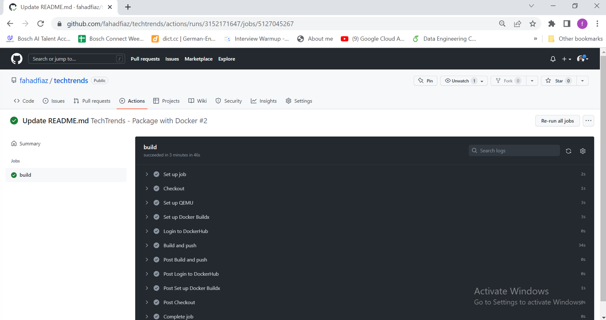
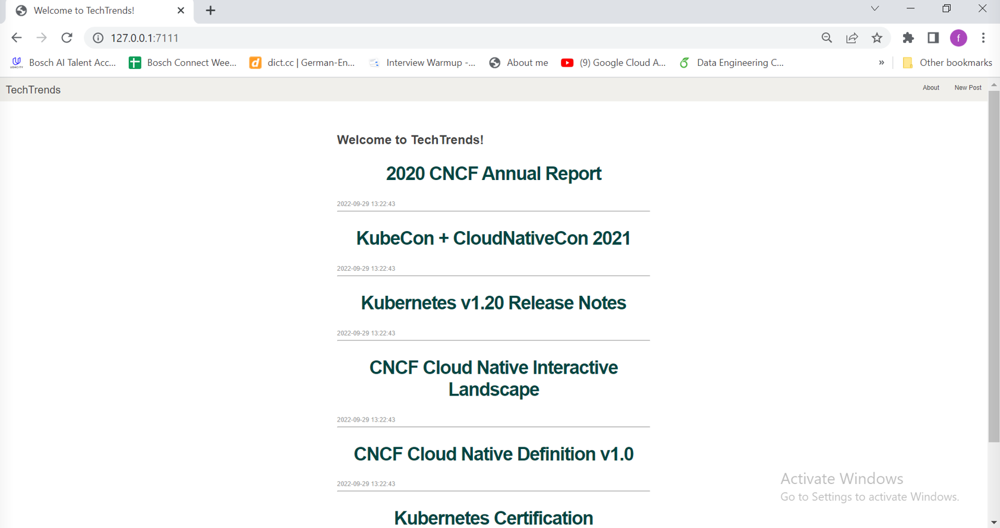

# Project: TechTrends 
-
TechTrends is an online website used as a news sharing platform, that enables consumers to access the latest news within the cloud-native ecosystem. In addition to accessing the available articles, readers are able to create new media articles and share them.

I recently joined a small team as a Platform Engineer. The team is composed of 2 developers, 1 platform engineer (me), 1 project manager, and 1 manager. The team was assigned with the TechTrends project, aiming to build a fully functional online news sharing platform. The developers in the team are currently working on the first prototype of the TechTrends website. As a platform engineer, my resposibility was to package and deploy TechTrends to Kubernetes using a CI/CD pipeline.

The web application is written using the Python Flask framework. It uses SQLite, a lightweight disk-based database to store the submitted articles.

Below you can examine the main components of the firsts prototype of the application:

## Project Steps Overview
---
1) Apply the best development practices and develop the status and health check endpoints for the TechTrends application.

2) Package the TechTrends application by creating a Dockerfile and Docker image.

3) Implement the Continuous Integration practices, by using GitHub Actions to automate the build and push of the Docker image to DockerHub.

4) Construct the Kubernetes declarative manifests to deploy TechTrends to a sandbox namespace within a Kubernetes cluster. The cluster is provisioned using k3s in a vagrant box. 

5) Template the Kubernetes manifests using a Helm chart and provide the input configuration files for staging and production environments.

6) Implement the Continuous Delivery practices, by deploying the TechTrends application to staging and production environments using ArgoCD and the Helm chart. 

## Description of the Project Files
---
1) **README.md** contains the main steps of how to execute the TechTrends application
2) **__init__.py** is a reserved method used to indicate that a directory is a Python package
3) **app.py** contains the main logging of the TechTrends application
4) **init_db.py** is a file that is used to initialize the posts database with a set of articles
5) **requirements.txt** contains a list of packages that need to be installed before running the TechTrends application
6) **schema.sql** outlines the posts database schema
7) **static/** folder contains the CSS files
8) **templates/** folder outlines the HTML structure of the TechTrends application

Within the **project folder** you will notice some extra folders and files. These are used to record the commands and output screenshots.

- argocd - the folder that will contain the ArgoCD manifests
- helm - the folder that will contain the Helm chart files
- kubernetes - the folder that will contain Kubernetes declarative manifests
- screenshots - the folder that will contain all the screenshots that depicts the working of complete  CI/CD pipeline
- Vagrantfile - the file containing the configuration for the vagrant box. Will be used to create a vagrant box locally.
- docker_commands - the file will be used to record any used Docker commands and outputs

## Instructions to run the project
---
1) Initialize the database by using the python **init_db.py** command. This creates or overwrites (if the file already exists) the **database.db** file that is used to store and access the available posts.
2) Run the TechTrends application by using the python **app.py** command. The application is running on port **3111** and you can access it by querying the **http://127.0.0.1:3111/** endpoint.

